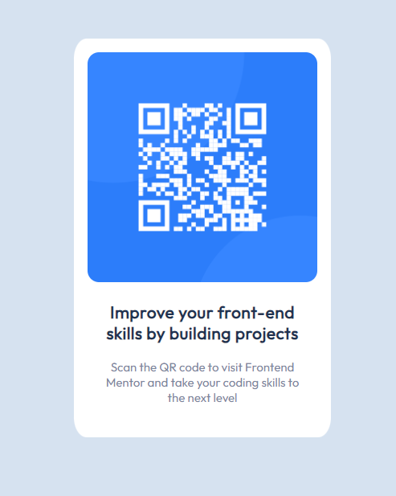

# Frontend Mentor - QR code component solution

This is a solution to the [QR code component challenge on Frontend Mentor](https://www.frontendmentor.io/challenges/qr-code-component-iux_sIO_H). Frontend Mentor challenges help you improve your coding skills by building realistic projects. 

## Table of contents

- [Overview](#overview)
  - [Screenshot](#screenshot)
  - [Links](#links)
  - [Built with](#built-with)
  - [What I learned](#what-i-learned)
  - [Continued development](#continued-development)
  - [Useful resources](#useful-resources)
- [Author](#author)

**Note: Delete this note and update the table of contents based on what sections you keep.**

## Overview

The website is the QR Code component project from FrontendMentor.io. It's display qr pic that's meant to link to the homepage site and is meant to be a starting exercise for building a webpage using html/css.

### Screenshot

Add a screenshot of your solution. The easiest way to do this is to use Firefox to view your project, right-click the page and select "Take a Screenshot". You can choose either a full-height screenshot or a cropped one based on how long the page is. If it's very long, it might be best to crop it.

Alternatively, you can use a tool like [FireShot](https://getfireshot.com/) to take the screenshot. FireShot has a free option, so you don't need to purchase it. 

Then crop/optimize/edit your image however you like, add it to your project, and update the file path in the image above.

**Note: Delete this note and the paragraphs above when you add your screenshot. If you prefer not to add a screenshot, feel free to remove this entire section.**

### Links

- Solution URL: [Add solution URL here](https://your-solution-url.com)
- Live Site URL: [Add live site URL here](https://your-live-site-url.com)

### Built with

- Semantic HTML5 markup
- Flexbox

### What I learned

This project was really a good way of both refreshing and working out the gaps in my knowledge in regards to html/css. My big struggle with this was figuring out how to position the container/block holding the qr code and text and making sure it matched up with the design pics given, even going as far as to use an installed screen pixel ruler to compare. It's still not an exact one-one match but learning to accept it won't be I think was also an important lesson as well.

I also had to give some thought to the size of the container and whether it should differ in screen sizes across different devices. It should've been self-evident from the screen designs, but I needed time to digest and understand that the qr code's width should be small enough to fit a 320px screen but otherwise wouldn't increase in size on a larger screen. It should remain consistent.

There was space around the container in the mobile design pic so I was considering whether the spacing should've still been left on smaller screen sizes. I decided it would be okay not to worry about that spacing in that particular case. It would've taken more effort than necessary to try and retain it and was not needed design-wise.

I tried not to use the flex-box for positioning until I had to figure out how to vertically center the container. Upon exploring options I found using the flex box was the simplest method, particularly since it was meant to assist with positioning elements 1 dimensionally.  

The style-guide only gave a font-size of 15px which I used as the default or root size. But I had to make guess observations for the size of the heading text and also slightly increase the word spacing in the heading.

Beyond that, everything else was mostly determined by guess-work. My only concern was that the heading is not as bold or has as heavy of a text-weight font as the original design (I wasn't able to find a way to achieve that). However, the design is mostly consistent and as I mentioned in the beginning, I don't believe it needs to be an exact 1-1 match down to the pixel.  
  

**Note: Delete this note and the content within this section and replace with your own learnings.**

### Continued development

Use this section to outline areas that you want to continue focusing on in future projects. These could be concepts you're still not completely comfortable with or techniques you found useful that you want to refine and perfect.

This project helped a lot in cementing the knowledge in html and css I've known about. What I would like work on going forward is in practicing further in problem solving to be able to handle and come to a solution quicker. I would also futher want to study further on using the google API for to pull, access, and use the font-family so I know the full extent of it's limitation. Hopefully the issues I came across and resolved in this project will allow me to better quickly resolve similar issues in future projects.

### Useful resources

- [W3- HOW TO - Center Elements Vertically](https://www.w3schools.com/howto/howto_css_center-vertical.asp)
- [CSS Vertical Align – How to Center a Div, Text, or an Image](https://www.freecodecamp.org/news/css-vertical-align-how-to-center-a-div-text-or-an-image-example-code/) - This and the above link helped me in determining how to best center an element vertically on a web page (which led me to choosing flexbox)

## Author

- Website - [ava8tor](https://github.com/ava8tor)